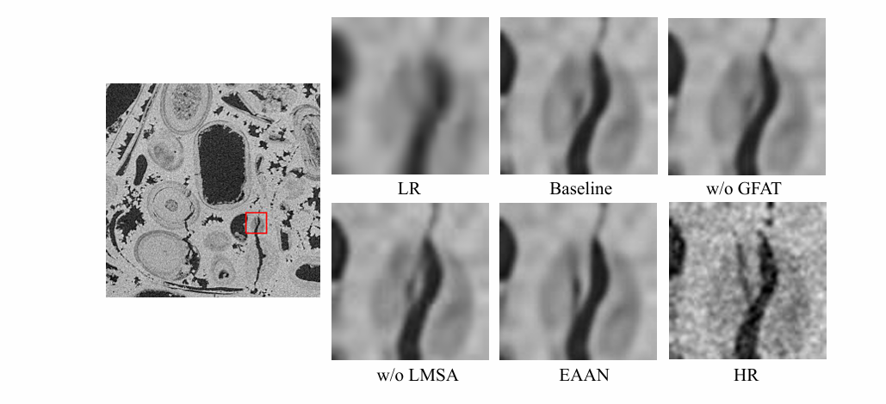

# EAAN: Efficient Adaptive Aggregation Network for Digital Rock Image Super-Resolution

[](https://www.python.org/)
[](https://pytorch.org/)


This repository contains the official PyTorch implementation of the paper  
**"EAAN: Efficient Adaptive Aggregation Network for Digital Rock Image Super-Resolution"**  


---

# 📖 Abstract

Recently, deep convolutional neural network (CNN)-based super-resolution methods for digital rock images have made significant progress in reconstructing pore structures and mineral composition details from low-resolution inputs. However, these approaches still face clear limitations. On the one hand, the inherently local receptive field of CNNs struggles to accurately reconstruct complex microstructures such as pore networks and tortuous throats. On the other hand, most existing architectures are built with excessive network depth, resulting in high computational costs and limiting their deployment on resource-limited devices. In this work, we propose an Efficient Adaptive Aggregation Network (EAAN) for two-dimensional digital rock image super-resolution reconstruction. The proposed network integrates a dual branch residual attention block (DBRAB) with an embedded linear multi-scale semantic attention (LMSA) module, together with a global feature adaptive transformer (GFAT), forming a hybrid CNN-Transformer cooperation framework. This architecture achieves joint optimization of local feature enhancement and global dependency modeling while maintaining an efficient lightweight design. Validated on the DeepRock-SR 2D datasets, the introduced EAAN architecture exhibits a clear advantage over contemporary methods by simultaneously improving image fidelity and minimizing computational demands. Crucially, beyond standard visual metrics, our evaluations verify that EAAN accurately preserves critical petrophysical properties, providing reliable data support for downstream reservoir characterization.

<p align="center">
  
  <br>
  <em>Overall architecture of the proposed EAAN framework.</em>
</p>

---

# ⚙️ Requirements

The code has been tested on **Ubuntu 20.04**, **NVIDIA A100 GPU**, and **CUDA 12.4**.

Dependencies:

- Python 3.8+
- PyTorch 2.6.0
- torchvision
- numpy
- scipy
- pillow
- scikit-image
- h5py
- importlib

---

# 📂 Dataset Preparation

We use the public **DeepRock-SR 2D database**:

### 1. Organize the dataset

```
train/
├── train_HR
└── train_LR
    └── X4
```

### 2. Convert images to `.h5`

To accelerate training I/O, convert images to HDF5 format:

```bash
python petrof5.py
```

This will generate:

```
DeepRock2D_new_default.h5
```

Place testing datasets (e.g., Carbonate dataset) in:

```
dataset/test_data/
```

---

# 🚀 Quick Start: Testing

We provide pretrained models in the `checkpoints` directory.

Example: **4× Super-resolution**

```bash
python sample.py \
--test_data_dir dataset/test_data/carbo_test \
--scale 4 \
--ckpt_path ./checkpoints/your_pretrained_model.pth.tar \
--sample_dir ./sample
```

The reconstructed images will be saved in:

```
./sample
```

---

# 🏋️ Training

Default training settings:

- Initial learning rate: **0.001**
- LR decay: **400k steps**
- Max steps: **500k**

Example training command:

```bash
python train.py \
--train_data_path DeepRock2D_new_default.h5 \
--valid_data_path dataset/test_data/carbo_test \
--scale 4 \
--patch_size 64 \
--batch_size 64 \
--lr 0.001 \
--decay 400000 \
--max_steps 500000 \
--ckpt_dir ./checkpoint \
--loss_fn L1
```

⚠️ Recommended hardware: **NVIDIA A100 GPU**

If **Out-of-Memory (OOM)** occurs, reduce:

```
--batch_size
```

---

# 📊 Results & Visualization

EAAN achieves strong reconstruction performance while maintaining a lightweight architecture.

- Parameters: **543K**
- Multi-Adds: **37.7G**

The network effectively restores **fine textures** and **pore connectivity**.

<details>
<summary>Visual comparison results</summary>

<p align="center">


<em>4× SR results on carbonate and sandstone datasets.</em>
</p>

</details>

